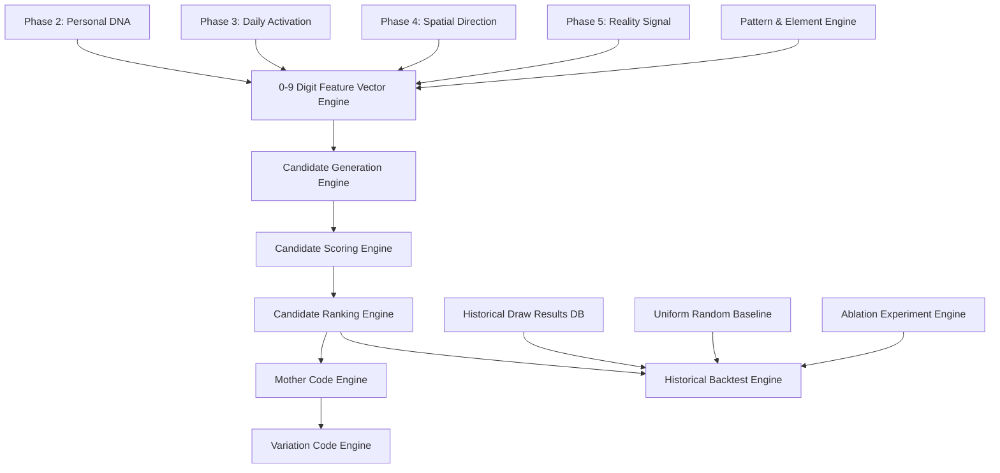

# ZWTSP Phase 6 Architectural Audit (数理综合与前瞻回测审计)

## 1. 概览与前置阶段审查

紫微时空数字预测系统（ZWTSP）经过 Phase 1 到 Phase 5 的系统化建设，已具备完整的先天气象、时间时辰、空间方位及现实信号数据资产：

| 阶段 | 支柱 | 核心引擎与资产 | 状态 | 在 Phase 6 中的复用方式 |
| :--- | :--- | :--- | :--- | :--- |
| **Phase 1** | 数 (Foundation) | 数字 0-9 五行/阴阳/河图/洛书基础库 | 已验证 | 作为候选号码元素属性、数理特征判定的基底 |
| **Phase 2** | 象 (Destiny) | 四柱八字、紫微斗数命盘、个人数字DNA | 已验证 | 提供个人本命数字权重 (20%) 与核心契合度 (15%) |
| **Phase 3** | 时 (Time) | 24节气、流日干支、当日数字/宫位激活 | 已验证 | 提供流日时空激活分 (20%) 与吉时时间窗口 |
| **Phase 4** | 位 (Position) | 八方九宫、个人方位档案、流日方位罗盘 | 已验证 | 提供空间方位数理共振分 (10%) 与对应洛书/地支数 |
| **Phase 5** | 象 (Observation) | 现实信号规范、车牌/门牌等12类输入标准化 | 已规划 | 提供用户日常观察到的现实数字共振分 (20%) |

---

## 2. Phase 6 核心职责与架构断言

Phase 6 将前五阶段的所有要素通过严谨的数学加权与空间阵列综合为**确定性候选号码集合（Candidate Pool）**、提取**母码（Mother Code）**与**衍生变体码（Variation Codes）**，并建立**零未来数据泄露（Zero Look-ahead Bias）的滚动回测系统（Backtest Engine）**。

### 核心安全与合规红线
1. **绝非包赢预测**：
   - 严禁出现“必中”、“保赢”、“预测中奖号码”、“宇宙提示你买”等虚假神化文案。
   - 所有输出统称为“模型综合候选（Model Candidates）”、“母码（Mother Code）”、“历史回测结果（Backtest Result）”。
2. **零随机性与确定性输出**：
   - 生产环境中的预测候选生成算法为 $100\%$ 确定性计算；输入相同，输出严格唯一。
   - 随机基准（Uniform Random Baseline）仅在回测实验中作为对比对照组使用，且必须采用固定随机种子以保证结果可重现。
3. **前瞻回测防泄露隔离（Anti-Lookahead Guard）**：
   - 回测历史某期 $T$ 时，系统必须站在开奖时刻之前，严禁引入 $T$ 时刻之后的任何开奖结果、现实信号或动态频率。

---

## 3. 依赖关系与模块划分

